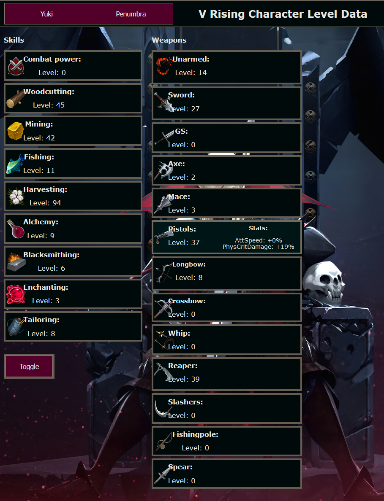
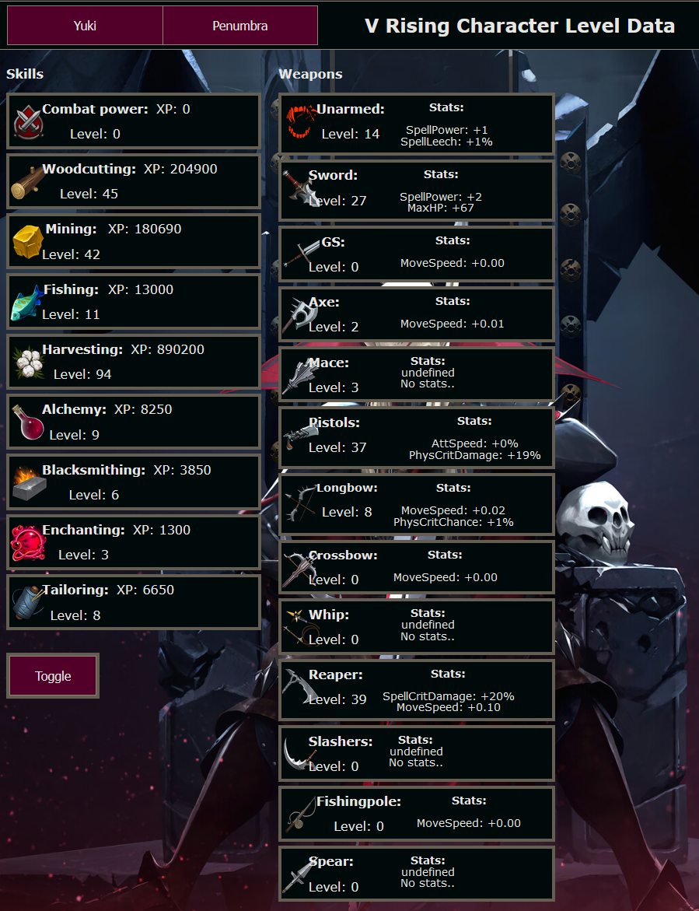

# BloodcraftWebUI

A WebUI for V Rising mod called BloodCraft.
Bloodcraft mod is NOT made by me, but made by Mitch.

This mod is just my project to make my and my friend's playthrough more enjoyable
and checking levels and stats easier.  
Feel free to use this project in your own
servers and make improvements and pull requests.  

Currently this works by putting all the files in a folder
on a dedicated server to "VRisingServer" folder.
It needs a server for the JavaScript to handle the data reading.
This project also needs player_experience.json file to have all the players listed.

Current functionality:

- Show levels and total experience of professions  
- Show Levels and chosen stats and their values of Weapons.  

Functionality can be extended to BloodLegacies by continuing the code with same logic.

TODO:

- Custom icons (Not ripped from V Rising assets)  
- Player selector that scales better with more players.  

Known bugs:

- PrimaryAttackSpeed is not calculated in pistols.

## Screenshots

Picture of site with me hovering over one expertise.

Picture of toggling all stats.

All the icons belongs to V Rising, This is not a product for sale,
but my own little project to make my own life easier.
